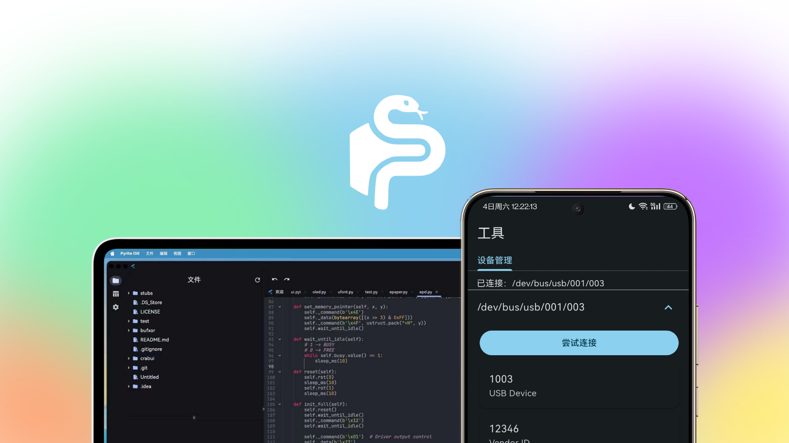

# PyriteIDE

一个现代化，强大，且跨平台的 MicroPython IDE
A modern and powerful MicroPython IDE designed for cross-platform use

> [!IMPORTANT]
> 本项目将在未来很长一段时间内保持早期阶段，在我们发布正式 Release 前，我们不建议你出于任何目的将该项目的成果用于生产环境。此处 README 及文档有待完善。